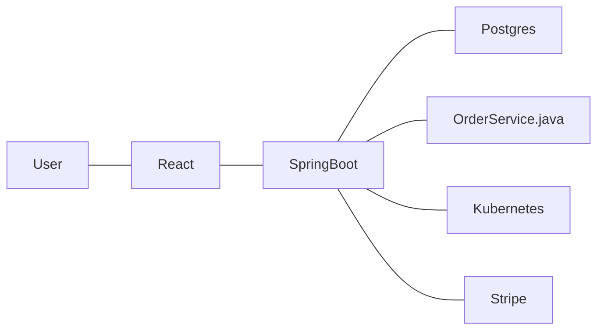
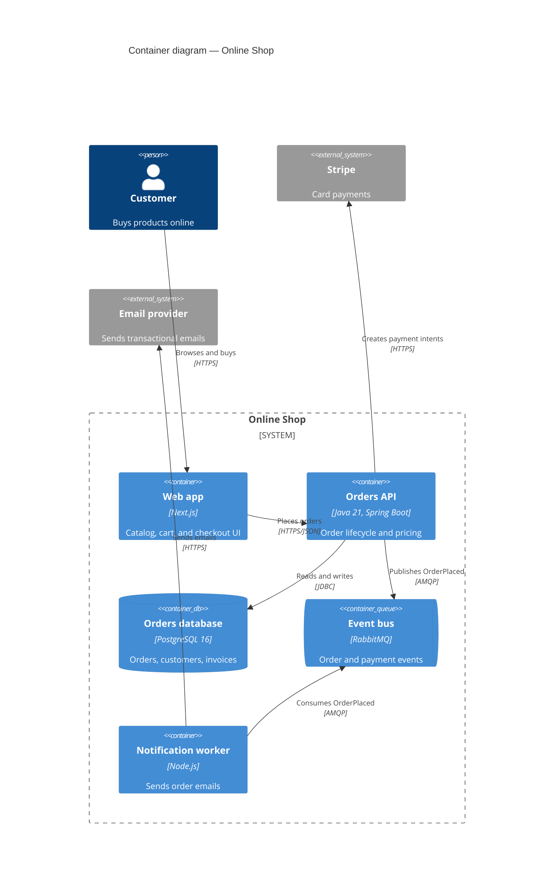

# Practical Examples

## Anti-Pattern (What NOT to do)

### 1. "Boxes and lines" with mixed levels and no labels

**Why it's wrong:**
- Technologies instead of responsibilities; a Java class and a Kubernetes cluster sit next to a database.
- Undirected, unlabeled lines hide who calls whom, why, and with which protocol.
- No title, no legend, no system boundary: the reader cannot tell what is internal or external.

### 2. Diagram only as an exported image
```text
docs/architecture.png   (last modified 2021, source file on a former colleague's laptop)
```
**Why it's wrong:**
- Nobody can update it; it silently drifts from reality and cannot be reviewed in a PR.

## Best Practice (How to do it right)

### 1. "Boxes and lines" with mixed levels and no labels (Mermaid C4)

**Why it's right:**
- One abstraction level (containers), each element with technology and responsibility, and an explicit system boundary.
- Directed relationships with intent and protocol show the data flow and the external dependencies.

### 2. Diagram only as an exported image (Structurizr DSL)
```text
workspace "Online Shop" {
  model {
    customer = person "Customer"
    shop = softwareSystem "Online Shop" {
      web = container "Web app" "Catalog, cart, and checkout UI" "Next.js"
      api = container "Orders API" "Order lifecycle and pricing" "Spring Boot"
      db  = container "Orders database" "Orders and invoices" "PostgreSQL" "Database"
    }
    customer -> web "Browses and buys" "HTTPS"
    web -> api "Places orders" "HTTPS/JSON"
    api -> db "Reads and writes" "JDBC"
  }
  views {
    systemContext shop "Context" { include * autolayout lr }
    container shop "Containers" { include * autolayout lr }
    theme default
  }
}
```
```yaml
# CI: validate and export on every PR
- run: structurizr-cli validate -workspace docs/architecture/workspace.dsl
- run: structurizr-cli export -workspace docs/architecture/workspace.dsl -format mermaid -output docs/architecture/generated
```
**Why it's right:**
- The model lives as code next to the system; both views derive from the same elements, so names stay consistent.
- CI validates and exports the diagrams, so changes are reviewed in PRs and published automatically.
