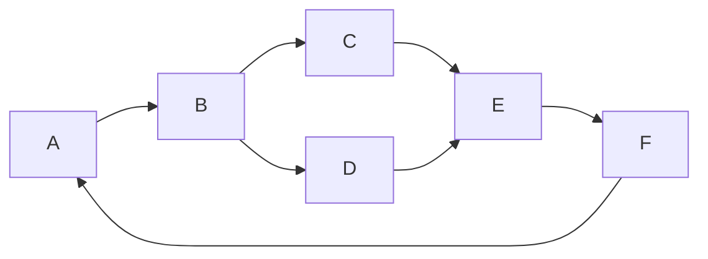
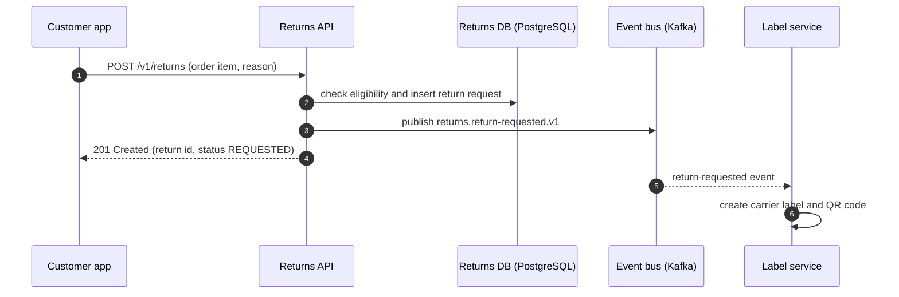
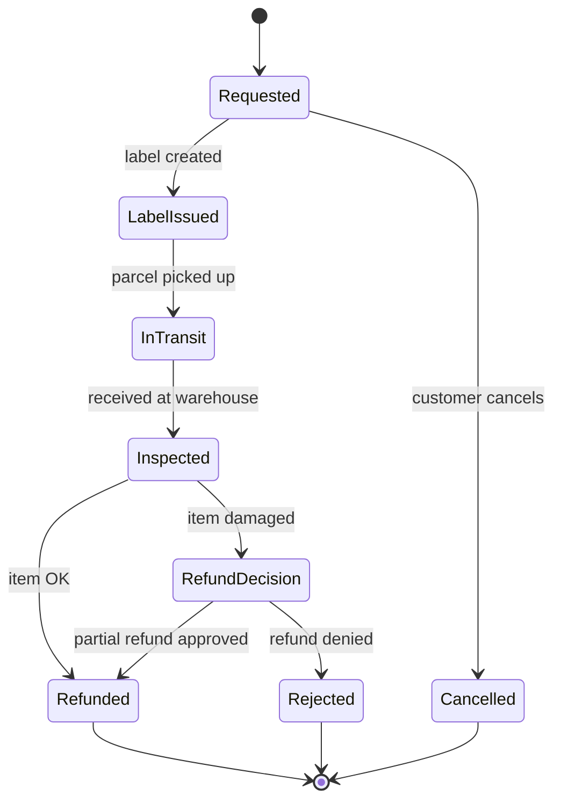

# Practical Examples

## Anti-Pattern (What NOT to do)

### 1. Everything in one unlabeled diagram

**Why it's wrong:**
- Boxes and arrows have no names, types, or actions; readers cannot tell what the diagram means.
- There is no title, legend, or text description.

## Best Practice (How to do it right)

### 1. Sequence diagram with labeled interactions

### 2. State diagram for the return lifecycle

```bash
npx -p @mermaid-js/mermaid-cli mmdc -i docs/explanation/returns.md -o build/returns.md   # fails on syntax errors
```
**Why it's right:**
- Each diagram answers one question with named participants, technologies, and labeled actions.
- Accessible titles and descriptions are included, and rendering in CI catches syntax errors.
