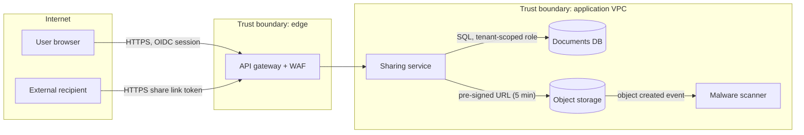

# Practical Examples

## Anti-Pattern (What NOT to do)

### 1. Generic checklist without a system model
```text
Threat model for "Document sharing" feature:
- SQL injection: use an ORM
- XSS: escape output
- DDoS: we are behind a CDN
Status: approved
```
**Why it's wrong:**
- No diagram, no trust boundaries, and no connection to how documents actually flow or who can access them.
- The real risks of the feature (link guessing, cross-tenant access, malicious uploads) are not considered, and nothing has owners.

## Best Practice (How to do it right)

### 1. Data flow diagram with trust boundaries (Mermaid)

### 2. STRIDE findings with decisions
```text
| ID  | Element / flow        | STRIDE | Threat                                                     | Risk | Decision / control                                              | Owner      |
|-----|-----------------------|--------|------------------------------------------------------------|------|-----------------------------------------------------------------|------------|
| T1  | X -> G share link     | S, I   | Guessable or leaked share links expose documents           | High | 256-bit random tokens, expiry, optional password, revoke (SHR-12) | team-share |
| T2  | S -> D                | E, I   | Missing tenant check lets user read other tenants' docs    | High | Tenant id from token, RLS on documents, IDOR tests (SHR-13)      | team-share |
| T3  | U -> B upload         | T      | Malicious files served to recipients                       | High | Quarantine bucket until AV scan passes, Content-Disposition attachment (SHR-14) | team-share |
| T4  | S                     | R      | User denies having shared a document                       | Med  | Append-only audit log of share/revoke events (SHR-15)            | team-share |
| T5  | G                     | D      | Link enumeration and scraping                              | Med  | Rate limits per IP and token, bot detection (SHR-16)             | team-edge  |
| T6  | Audit log             | I      | Logs contain document names with personal data             | Low  | Accept: names needed for audit; access restricted, review 2027-03 | security   |
```
**Why it's right:**
- The model follows the actual data flows and trust boundaries of the feature.
- Each threat is categorized, rated, and has a concrete control linked to a backlog item and an owner, or an explicit, time-bound acceptance.
