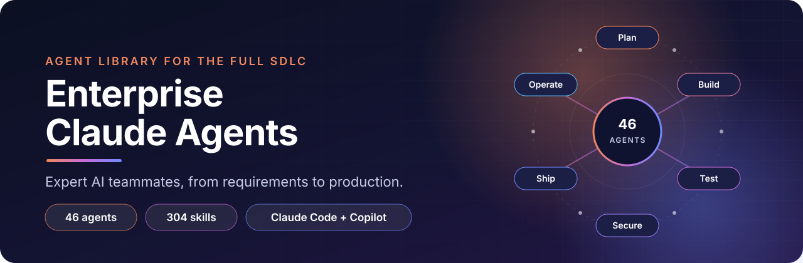
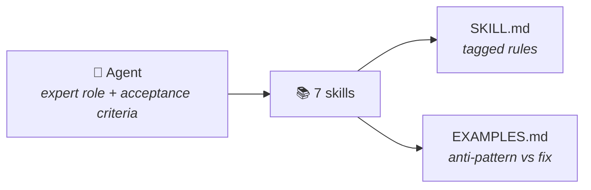

<div align="center">



<br>

[](LICENSE)
[](#-agents)
[](#-how-a-skill-works)
[](#claude-code)
[](#github-copilot)
[](https://github.com/asrms/enterprise-agents-claude-copilot/pulls)

**A ready-made team of expert AI agents for Claude Code and GitHub Copilot.**<br>
Drop one folder into your repo and get senior-level help on every phase of the SDLC, backed by clear, enforceable rules.

[Quick start](#-quick-start) · [Agents](#-agents) · [Usage](#-usage) · [How a skill works](#-how-a-skill-works) · [Customizing](#-customizing)

</div>

---

## ✨ What you get

<table>
<tr>
<td width="33%" valign="top">

### 🤖 46 agents
Expert roles (architect, reviewer, SRE, security, and more) with clear acceptance criteria. Each one combines 7 skills.

</td>
<td width="33%" valign="top">

### 📚 304 skills
Concrete, versioned rules: what is **mandatory**, what is **forbidden**, and **why**, plus side-by-side examples of anti-patterns and fixes.

</td>
<td width="33%" valign="top">

### 🔌 Two tools, one library
Same content for **Claude Code** (`.claude/`) and **GitHub Copilot** (`.github/`) in VS Code, Visual Studio, JetBrains, Copilot CLI, and the cloud agent.

</td>
</tr>
</table>

**Coverage at a glance**

| Phase | Stacks and topics |
|---|---|
| 🧭 **Plan and design** | Requirements, UX/UI, architecture, APIs, databases |
| ⚙️ **Backend and systems** | Java/Spring · Python/FastAPI · Node/TypeScript · .NET · Go · Kotlin · Rust · PHP/Laravel · Ruby on Rails · C++ |
| 🎨 **Frontend** | React/Next.js · Angular · Vue/Nuxt · vanilla JavaScript |
| 📱 **Mobile** | Android · iOS · Flutter · React Native |
| 🧠 **Data and AI** | Data engineering · machine learning · LLM and RAG apps |
| 🛡️ **Quality and security** | Code review · testing · performance · debugging · OWASP · DevSecOps |
| 🚀 **Deliver and operate** | GitHub Actions · GitLab CI · Azure DevOps · Jenkins · Docker · Kubernetes · Terraform · SRE |
| ☁️ **Cloud** | AWS · Azure · Google Cloud |

---

## 🚀 Quick start

Copy **only the folder for the tool you use** into the root of your project.

### Claude Code

<details open>
<summary><b>macOS / Linux</b></summary>

```bash
git clone --depth 1 https://github.com/asrms/enterprise-agents-claude-copilot.git /tmp/enterprise-agents
mkdir -p .claude
cp -r /tmp/enterprise-agents/.claude/agents /tmp/enterprise-agents/.claude/skills .claude/
```

</details>

<details>
<summary><b>Windows (PowerShell)</b></summary>

```powershell
git clone --depth 1 https://github.com/asrms/enterprise-agents-claude-copilot.git $env:TEMP\enterprise-agents
New-Item -ItemType Directory -Force .claude | Out-Null
Copy-Item -Recurse -Force $env:TEMP\enterprise-agents\.claude\agents, $env:TEMP\enterprise-agents\.claude\skills .claude\
```

</details>

> 💡 To use them in **all your projects**, copy the same two folders into `~/.claude/` instead.

### GitHub Copilot

<details open>
<summary><b>macOS / Linux</b></summary>

```bash
git clone --depth 1 https://github.com/asrms/enterprise-agents-claude-copilot.git /tmp/enterprise-agents
mkdir -p .github
cp -r /tmp/enterprise-agents/.github/agents /tmp/enterprise-agents/.github/skills .github/
```

</details>

<details>
<summary><b>Windows (PowerShell)</b></summary>

```powershell
git clone --depth 1 https://github.com/asrms/enterprise-agents-claude-copilot.git $env:TEMP\enterprise-agents
New-Item -ItemType Directory -Force .github | Out-Null
Copy-Item -Recurse -Force $env:TEMP\enterprise-agents\.github\agents, $env:TEMP\enterprise-agents\.github\skills .github\
```

</details>

> 💡 To use them in **all your projects**, copy `agents` and `skills` into `~/.copilot/` (VS Code, Copilot CLI). In Visual Studio, user-level agents go in `%USERPROFILE%\.github\agents` and user-level skills in `%USERPROFILE%\.copilot\skills`.

> [!WARNING]
> Don't copy both `.claude/` and `.github/` into the same project unless you use both tools. VS Code and Visual Studio read both folders, so every agent and skill would appear twice.

<details>
<summary><b>Only need one agent?</b></summary>

<br>

Copy the agent file plus every skill folder listed for it in the [Agents](#-agents) section. Some skills are shared between agents, so copy each listed folder even if you already have others.

Example, Spring only: `agents/java-spring-architect` (`.md` for Claude Code, `.agent.md` for Copilot) plus the seven `skills/spring-*` folders.

</details>

---

## 💬 Usage

**Claude Code**

- Ask for an agent by name: *"Use the java-spring-architect agent to add a paginated orders endpoint."*
- Claude also delegates to an agent on its own when the task matches its description.
- Skills load automatically when relevant. Run `/agents` to list the installed agents.

**GitHub Copilot**

- **VS Code:** open Copilot Chat and pick the agent from the agents dropdown.
- **Visual Studio:** open Copilot Chat and pick the agent from the agent picker.
- **Copilot CLI and cloud agent:** agents in `.github/agents` are available automatically.
- Skills load automatically when relevant. In VS Code you can also call one directly with `/skill-name` (e.g. `/spring-jpa-performance`).

---

## 🤖 Agents

Agents are grouped by development phase. Click **Skills** under each group to see what every agent is built from. Some skills are shared (for example `typescript-strict-mode`, `api-design-openapi`, `accessibility-wcag`, `observability-opentelemetry`, `profiling-cpu-memory`, `security-gates-ci`, `llm-client-resilience`).

### 🧭 Plan and design

| Agent | What it does |
|---|---|
| `requirements-analyst` | User stories, Gherkin acceptance criteria, NFRs, EventStorming, prioritization, estimation, traceability |
| `ux-ui-designer` | Design systems and tokens, usability heuristics, user research, responsive layouts, accessibility, handoff, microcopy |
| `solution-architect` | Architecture decisions (ADRs), C4 diagrams, DDD boundaries, integration patterns, NFRs |
| `api-designer` | Contract-first REST (OpenAPI), events (AsyncAPI), GraphQL, gRPC, API security and governance |
| `database-architect` | Relational and NoSQL data modeling, zero-downtime migrations, query tuning, privacy, backup and HA |

<details>
<summary><b>Skills</b></summary>

| Agent | Skills |
|---|---|
| `requirements-analyst` | `user-stories-invest`, `acceptance-criteria-gherkin`, `nonfunctional-requirements`, `domain-discovery-event-storming`, `backlog-prioritization`, `estimation-techniques`, `requirements-traceability` |
| `ux-ui-designer` | `design-system-tokens`, `ux-heuristics-usability`, `user-research-methods`, `responsive-layout`, `accessibility-wcag`, `design-to-code-handoff`, `microcopy-content-design` |
| `solution-architect` | `architecture-decision-records`, `c4-architecture-diagrams`, `ddd-strategic-design`, `modular-monolith-vs-microservices`, `integration-patterns-saga`, `nfr-capacity-planning`, `architecture-fitness-functions` |
| `api-designer` | `api-design-openapi`, `asyncapi-event-contracts`, `graphql-schema-design`, `grpc-protobuf`, `api-versioning-deprecation`, `api-security-oauth2`, `api-governance-spectral` |
| `database-architect` | `relational-data-modeling`, `schema-migrations`, `indexing-query-optimization`, `postgresql-performance-tuning`, `nosql-data-modeling`, `data-retention-privacy`, `database-backup-ha` |

</details>

### ⚙️ Build: backend and systems

| Agent | What it does |
|---|---|
| `java-spring-architect` | Java 21 / Spring Boot 3.3+ services and REST APIs |
| `python-fastapi-ai-integrator` | Python 3.12+ / FastAPI microservices with resilient, secure LLM integration |
| `node-typescript-backend` | Node.js/TypeScript services with NestJS, Fastify, or Express and Prisma/Drizzle |
| `dotnet-architect` | C# / ASP.NET Core on the current .NET LTS, clean architecture, EF Core |
| `go-cloud-native` | Idiomatic Go services, CLIs, concurrency, HTTP/gRPC, profiling |
| `kotlin-backend` | Kotlin services with Ktor or Spring, coroutines, data access, Kotest/MockK, kotlinx.serialization |
| `rust-systems` | Safe, fast Rust: ownership, error handling, Tokio, axum services, unsafe/FFI, performance, testing |
| `php-laravel` | Laravel on PHP 8.3+: architecture, Eloquent performance, security, queues, Pest, static analysis, deployment |
| `ruby-rails` | Rails 8: architecture, Active Record performance, security, background jobs, RSpec, static analysis, deployment |
| `cpp-modern` | C++20/23: modern idioms, RAII and memory safety, CMake, concurrency, performance, sanitizers and fuzzing, GoogleTest |

<details>
<summary><b>Skills</b></summary>

| Agent | Skills |
|---|---|
| `java-spring-architect` | `spring-hexagonal-architecture`, `spring-jpa-performance`, `spring-security-hardening`, `spring-async-processing`, `spring-rest-api-design`, `spring-unit-testing-mockito`, `spring-config-observability` |
| `python-fastapi-ai-integrator` | `fastapi-clean-architecture`, `fastapi-pydantic-contracts`, `fastapi-async-performance`, `fastapi-security-auth`, `llm-client-resilience`, `llm-prompt-injection-defense`, `fastapi-testing-pytest` |
| `node-typescript-backend` | `typescript-strict-mode`, `nestjs-architecture`, `fastify-express-hardening`, `prisma-drizzle-data-access`, `node-async-performance`, `node-testing-supertest`, `api-design-openapi` |
| `dotnet-architect` | `aspnetcore-minimal-apis`, `clean-architecture-dotnet`, `ef-core-performance`, `dotnet-security-identity`, `dotnet-async-performance`, `xunit-testing`, `observability-opentelemetry` |
| `go-cloud-native` | `go-project-layout`, `go-concurrency-patterns`, `go-error-handling`, `go-http-grpc-services`, `go-performance-profiling`, `go-testing`, `go-security` |
| `kotlin-backend` | `kotlin-idioms`, `kotlin-coroutines-flow`, `ktor-services`, `spring-kotlin`, `kotlin-data-access`, `kotlin-testing-kotest-mockk`, `kotlin-serialization` |
| `rust-systems` | `rust-ownership-patterns`, `rust-error-handling`, `rust-async-tokio`, `axum-services`, `rust-unsafe-ffi`, `rust-performance`, `rust-testing` |
| `php-laravel` | `laravel-architecture`, `eloquent-performance`, `laravel-security`, `laravel-queues-jobs`, `pest-testing`, `php-static-analysis`, `laravel-deployment` |
| `ruby-rails` | `rails-architecture`, `active-record-performance`, `rails-security`, `rails-background-jobs`, `rspec-testing`, `ruby-static-analysis`, `rails-deployment` |
| `cpp-modern` | `modern-cpp-idioms`, `memory-safety-raii`, `cmake-build`, `cpp-concurrency`, `cpp-performance`, `sanitizers-fuzzing`, `googletest-testing` |

</details>

### 🎨 Build: frontend

| Agent | What it does |
|---|---|
| `react-nextjs-strict` | Next.js 15+/16 App Router, React 19, strict TypeScript |
| `angular-enterprise` | Current Angular with standalone components, signals, RxJS, zoneless performance |
| `vue-nuxt` | Vue 3 Composition API, Pinia, and Nuxt rendering and caching strategies |
| `javascript-vanilla-ninja` | Framework-free ES2023+ frontends and Web Components |

<details>
<summary><b>Skills</b></summary>

| Agent | Skills |
|---|---|
| `react-nextjs-strict` | `nextjs-app-router-architecture`, `typescript-strict-mode`, `nextjs-data-fetching-caching`, `nextjs-security-hardening`, `react-performance-optimization`, `react-testing-strategy`, `react-accessibility-wcag` |
| `angular-enterprise` | `angular-standalone-architecture`, `angular-signals-state`, `rxjs-patterns`, `angular-performance`, `angular-security`, `angular-testing`, `accessibility-wcag` |
| `vue-nuxt` | `vue-composition-api`, `pinia-state`, `nuxt-rendering-caching`, `vue-performance`, `vue-security`, `vue-testing-vitest`, `accessibility-wcag` |
| `javascript-vanilla-ninja` | `js-modular-architecture`, `js-dom-performance`, `js-async-concurrency`, `js-dom-xss-security`, `js-web-components`, `js-memory-management`, `js-testing-vitest` |

</details>

### 📱 Build: mobile

| Agent | What it does |
|---|---|
| `android-kotlin` | Native Android with Kotlin, Jetpack Compose, coroutines, and Google Play releases |
| `ios-swift` | Native iOS with Swift 6, SwiftUI, strict concurrency, and App Store releases |
| `cross-platform-mobile` | Flutter and React Native apps with offline sync, security, and store CI/CD |

<details>
<summary><b>Skills</b></summary>

| Agent | Skills |
|---|---|
| `android-kotlin` | `jetpack-compose-ui`, `android-architecture-mvvm`, `kotlin-coroutines-flow`, `android-security`, `android-performance`, `android-testing`, `play-store-release` |
| `ios-swift` | `swiftui-architecture`, `swift-concurrency`, `ios-security-keychain`, `ios-performance`, `xctest-testing`, `app-store-release`, `accessibility-wcag` |
| `cross-platform-mobile` | `flutter-architecture`, `react-native-architecture`, `mobile-state-management`, `mobile-offline-sync`, `mobile-security`, `mobile-testing`, `mobile-release-ci` |

</details>

### 🧠 Data and AI

| Agent | What it does |
|---|---|
| `data-engineer` | dbt, Spark, Airflow, data quality, Iceberg/Delta lakehouses, Kafka/Flink, governance |
| `ml-engineer` | Experiment tracking, feature pipelines, evaluation, serving, MLOps, drift monitoring, PyTorch |
| `llm-rag-engineer` | RAG retrieval, vector stores, LLM evaluation, tool-using agents, cost and latency |

<details>
<summary><b>Skills</b></summary>

| Agent | Skills |
|---|---|
| `data-engineer` | `dbt-modeling`, `spark-performance`, `airflow-orchestration`, `data-quality-testing`, `lakehouse-iceberg-delta`, `streaming-kafka-flink`, `data-governance-lineage` |
| `ml-engineer` | `ml-experiment-tracking`, `feature-pipelines`, `model-evaluation`, `model-serving`, `mlops-ci-cd`, `model-monitoring-drift`, `pytorch-training` |
| `llm-rag-engineer` | `rag-retrieval-design`, `embeddings-vector-stores`, `llm-evaluation`, `agent-tool-design`, `llm-prompt-injection-defense`, `llm-client-resilience`, `llm-cost-latency-optimization` |

</details>

### 🛡️ Quality, performance, and security

| Agent | What it does |
|---|---|
| `code-reviewer` | Read-only pull request review for any language: design, correctness, security, tests |
| `qa-test-architect` | Test strategy, Playwright E2E, contract tests, test data, flaky tests, mutation and accessibility testing |
| `performance-engineer` | Load testing, profiling, capacity planning, caching, query tuning, Core Web Vitals, performance budgets in CI |
| `debugging-specialist` | Root cause analysis, reproductions, logs and traces, profiling, concurrency bugs, production debugging, git bisect |
| `owasp-security-reviewer` | Read-only OWASP Top 10 code review producing a report with CVSS, CWE, and fixes |
| `devsecops-engineer` | SAST, SCA, secrets detection, DAST, supply chain, security gates, vulnerability triage |
| `security-architect` | Threat modeling, identity (OAuth 2.0/OIDC), zero trust, cloud IAM, encryption, privacy, SIEM |

<details>
<summary><b>Skills</b></summary>

| Agent | Skills |
|---|---|
| `code-reviewer` | `code-review-practices`, `clean-code-principles`, `refactoring-catalog`, `secure-coding-fundamentals`, `test-quality-review`, `pr-feedback-conventions`, `complexity-metrics` |
| `qa-test-architect` | `test-strategy-pyramid`, `e2e-testing-playwright`, `contract-testing-pact`, `test-data-management`, `flaky-test-prevention`, `mutation-testing`, `accessibility-testing` |
| `performance-engineer` | `load-testing-k6-gatling`, `profiling-cpu-memory`, `nfr-capacity-planning`, `caching-strategies`, `indexing-query-optimization`, `core-web-vitals`, `performance-budgets-ci` |
| `debugging-specialist` | `root-cause-analysis`, `bug-reproduction`, `log-trace-analysis`, `profiling-cpu-memory`, `concurrency-bugs`, `production-debugging`, `git-bisect` |
| `owasp-security-reviewer` | `security-review-methodology`, `owasp-injection-prevention`, `owasp-broken-access-control`, `owasp-authentication-session`, `owasp-cryptographic-failures`, `owasp-ssrf-deserialization`, `owasp-misconfiguration-logging` |
| `devsecops-engineer` | `sast-semgrep-codeql`, `sca-dependency-management`, `secrets-detection`, `dast-zap`, `container-supply-chain-security`, `security-gates-ci`, `vulnerability-triage` |
| `security-architect` | `threat-modeling-stride`, `identity-oauth2-oidc`, `zero-trust-network`, `cloud-iam-least-privilege`, `encryption-key-management`, `privacy-by-design-gdpr`, `security-logging-siem` |

</details>

### 🧹 Maintain and document

| Agent | What it does |
|---|---|
| `legacy-modernizer` | Strangler fig migrations, characterization tests, framework and dependency upgrades, monolith decomposition, dead code |
| `technical-writer` | READMEs, API reference docs, ADRs, runbooks, docs as code, Mermaid diagrams, changelogs and release notes |

<details>
<summary><b>Skills</b></summary>

| Agent | Skills |
|---|---|
| `legacy-modernizer` | `strangler-fig-migration`, `characterization-tests`, `framework-upgrades`, `monolith-decomposition`, `dependency-upgrades`, `dead-code-removal`, `refactoring-catalog` |
| `technical-writer` | `readme-standards`, `api-reference-docs`, `architecture-decision-records`, `runbooks`, `docs-as-code`, `diagrams-as-code-mermaid`, `changelog-release-notes` |

</details>

### 🚀 Deliver and operate

| Agent | What it does |
|---|---|
| `docker-container-master` | Dockerfiles, OCI images, and Docker Compose |
| `github-actions-engineer` | GitHub Actions CI/CD: reusable workflows, hardening, OIDC, deployments, releases |
| `gitlab-ci-engineer` | GitLab CI/CD: pipeline design, CI/CD components, security and OIDC, performance, environments, runners |
| `azure-devops-engineer` | Azure Pipelines YAML and templates, workload identity federation, environments and checks, agents, Azure Repos policies |
| `jenkins-pipeline-engineer` | Jenkins CI/CD on Kubernetes agents, "build once, deploy many" |
| `release-manager` | Branching, SemVer and Conventional Commits, changelogs, feature flags, rollbacks |
| `kubernetes-platform-engineer` | Kubernetes workloads, Helm, Kustomize, GitOps, security, autoscaling, networking |
| `terraform-iac-engineer` | Terraform/OpenTofu modules, state, environments, security scanning, policy as code, drift |
| `sre-reliability-engineer` | SLOs and error budgets, alerting, incidents and postmortems, runbooks, chaos, resilience |

<details>
<summary><b>Skills</b></summary>

| Agent | Skills |
|---|---|
| `docker-container-master` | `dockerfile-multistage-builds`, `docker-image-optimization`, `container-security-hardening`, `docker-secrets-management`, `docker-compose-orchestration`, `container-runtime-lifecycle`, `container-supply-chain-security` |
| `github-actions-engineer` | `reusable-workflows`, `actions-security-hardening`, `caching-matrix-builds`, `environments-deployments`, `oidc-cloud-auth`, `self-hosted-runners`, `release-automation` |
| `gitlab-ci-engineer` | `gitlab-ci-pipeline-design`, `gitlab-ci-components`, `gitlab-ci-security`, `gitlab-ci-performance`, `gitlab-environments-deployments`, `gitlab-runners`, `security-gates-ci` |
| `azure-devops-engineer` | `azure-pipelines-yaml`, `azure-pipelines-templates`, `azure-pipelines-security`, `azure-pipelines-performance`, `azure-pipelines-environments`, `azure-pipelines-agents`, `azure-repos-policies` |
| `jenkins-pipeline-engineer` | `jenkins-declarative-pipeline`, `jenkins-shared-libraries`, `jenkins-credentials-security`, `jenkins-kubernetes-agents`, `jenkins-quality-gates`, `jenkins-pipeline-performance`, `jenkins-deployment-strategies` |
| `release-manager` | `branching-strategies`, `conventional-commits-semver`, `changelog-release-notes`, `feature-flags`, `database-release-coordination`, `rollback-strategies`, `trunk-based-development` |
| `kubernetes-platform-engineer` | `k8s-workload-design`, `helm-charts`, `kustomize-overlays`, `gitops-argocd-flux`, `k8s-security-pss-rbac`, `k8s-autoscaling-resources`, `k8s-networking-ingress` |
| `terraform-iac-engineer` | `terraform-module-design`, `terraform-state-management`, `multi-environment-layout`, `iac-security-scanning`, `policy-as-code-opa`, `terraform-testing`, `drift-management` |
| `sre-reliability-engineer` | `slo-sli-error-budgets`, `symptom-based-alerting`, `incident-response-postmortem`, `runbooks`, `chaos-engineering`, `observability-opentelemetry`, `resilience-patterns` |

</details>

### ☁️ Cloud platforms

| Agent | What it does |
|---|---|
| `aws-architect` | AWS Well-Architected reviews, landing zones, VPC, IAM, serverless, data services, FinOps |
| `azure-architect` | Azure Well-Architected reviews, landing zones, hub-and-spoke, Entra ID, hosting, data, cost |
| `gcp-architect` | Google Cloud framework reviews, org policies, VPC, IAM, Cloud Run, data services, cost |

<details>
<summary><b>Skills</b></summary>

| Agent | Skills |
|---|---|
| `aws-architect` | `aws-well-architected-review`, `aws-landing-zone-organizations`, `aws-networking-vpc`, `aws-iam-least-privilege`, `aws-serverless-lambda`, `aws-data-services`, `aws-cost-optimization-finops` |
| `azure-architect` | `azure-well-architected-review`, `azure-landing-zones`, `azure-networking-hub-spoke`, `azure-identity-entra-rbac`, `azure-app-hosting`, `azure-data-services`, `azure-cost-management` |
| `gcp-architect` | `gcp-architecture-framework-review`, `gcp-resource-hierarchy-org-policy`, `gcp-vpc-networking`, `gcp-iam-workload-identity`, `gcp-serverless-cloud-run`, `gcp-data-services`, `gcp-cost-optimization` |

</details>

---

## 🧩 How a skill works



Each skill is a folder with two files:

```
skills/spring-jpa-performance/
├── SKILL.md      # rules
└── EXAMPLES.md   # anti-patterns and best practices, side by side
```

Every rule in `SKILL.md` carries a tag:

| Tag | Meaning |
|---|---|
| `[MANDATORY]` | Must always be applied |
| `[FORBIDDEN]` | Must never appear in the code |
| `[SECURITY]` | Security requirement, never traded for convenience |
| `[ARCHITECTURE]`, `[PATTERN]` | Structural choices and recommended patterns |
| `[CONFIGURATION]`, `[PERFORMANCE]`, `[TESTING]` | Configuration, performance, and testing guidance |
| `[REVIEW]`, `[CWE]` | Review heuristics and CWE/OWASP mappings (security skills) |

> [!IMPORTANT]
> Agents treat `[MANDATORY]`, `[FORBIDDEN]`, and `[SECURITY]` rules as **binding**. If a request conflicts with one of them, the agent flags the conflict and proposes a compliant alternative.

---

## 🛠️ Customizing

The rules reflect common enterprise defaults (for example Java 21, Spring Boot 3.3+, Python 3.12+, Next.js 15+/16, the current Angular, .NET, and Node.js releases, Swift 6, and recent Go, Kubernetes, and Terraform versions). Adapt them freely: edit `SKILL.md` for rules and `EXAMPLES.md` for examples.

> [!NOTE]
> `.claude/` and `.github/` contain the same skills. Agents differ only in the header (tool names and skill references), so when you edit a skill or an agent's instructions, apply the same change in both folders.

---

## 📄 License

Released under the [MIT License](LICENSE).

<div align="center">
<sub>If this library saves you time, consider giving it a ⭐ on GitHub.</sub>
</div>
